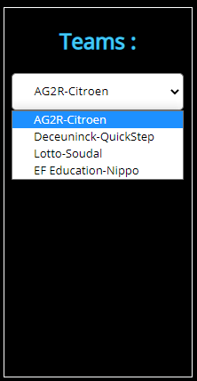
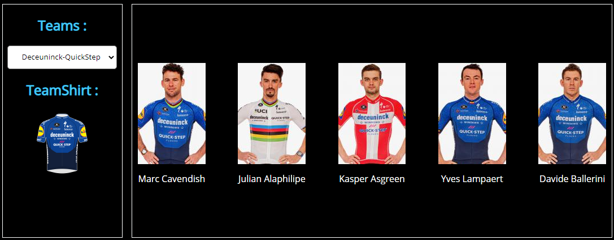
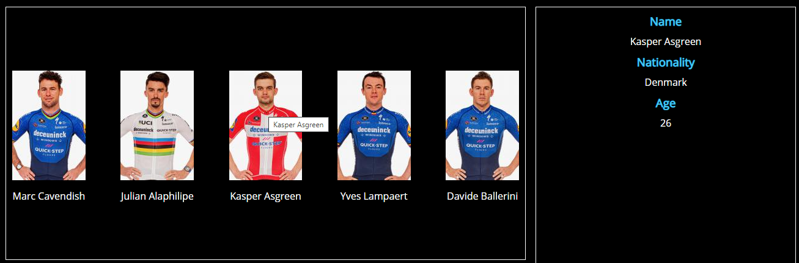
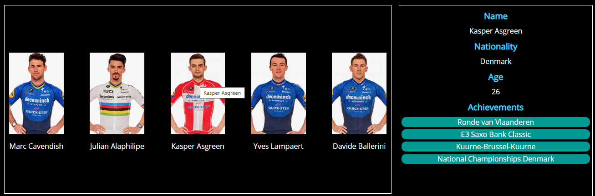
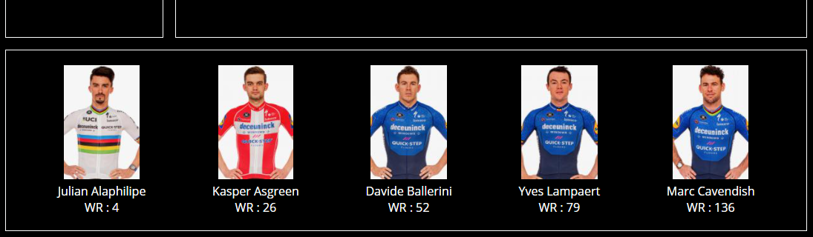

# Wielrennen | Examen Web Frontend Advanced AJ2021

## Algemene instructie examen (must read)
1. Dit examen bestaat uit 5 deelopdrachten met telkens een hogere moeilijkheidgraad. Werk de opdrachten in volgorde af om efficiënt te werken.

2. Er werd reeds HTML en CSS voorzien. Volg aandachtig de instructies in deze opdrachtomschijving om onmiddellijk een mooie opmaak te verkrijgen. 

3. Het is toegelaten om de CSS aan te passen. **De HTML behoudt zijn oorspronkelijke structuur.**

4. Het examen is **open boek**, dit betekent dat je de volledige cursus kan gebruiken, alsook alle oefeningen die tijdens de lessenreeks werden gebruikt.

5. Iedere vorm van samenwerking is **niet** toegelaten.

6. Maak regelmatig (per functionaliteit) een commit en push naar je online repo. Commit volgens de afspraken.

7. Iedere vaststelling van onregelmatigheid (o.a. GSM, spieken, afkijken) wordt conform het OER gemeld aan de betrokken student en aan de voorzitter van de examencommissie.

8. Dit examen maakt **60%** uit van de evaluatie voor de module Web Frontend Advanced (WFA).

9. De leerresultaten die tijdens dit examen getoetst worden, zijn:

    * 2.3.1. Leidt de best mogelijke technische oplossing af voor het softwareproject
    * 2.3.2. Bepaalt de nodige infrastructuur voor de softwareapplicatie
    * 2.3.4. Bepaalt het eigen handelen uit de methodiek en doelstellingen die werden opgemaakt
    * 3.2.11. Onderscheidt de verschillende componenten voor het maken van een functionele gebruikersinterface
    * 3.2.12. Brengt de componenten van de gebruikersinterface in verband met de gewenste functionaliteiten van de applicatie
    * 3.3.3. Selecteert de nodige tools en componenten voor het implementeren van de applicatie
    * 3.3.4. Maakt eenvoudige softwareapplicaties
    * 3.3.5. Selecteert de best passende gegevensstructuren
    * 3.3.6. Construeert een logische en samenhangende programmacode
    * 5.3.1. Gebruikt consequent de gemaakte codeerafspraken in afgebakende opdrachten
    * 5.3.2. Programmeert volgens de organisatiestandaarden
    * 6.2.5. Onderscheidt mogelijke oplossingen om tekortkomingen weg te werken

## Scoringstabel
De puntenverdeling is de volgende:
|Beoordeling|Punten|
|--|--|
|Naleven conventies| 2 pt.|
|DOM manipuleren| 1 pt.|
|Formulierelementen| 2 pt.|
|Codekwaliteit| 5 pt.|
|Pijlers van een webapplicatie (CSS, HTML, JavaScript)| 1 pt.|
|Events| 1 pt.|
|Gebruik git| 1 pt.|
|Json uitlezen| 4 pt.|
|Weergeven data| 6 pt.|
|Kennis array-functions| 2 pt.|
|Algehele progressie (# succesvol afgewerkte opdrachten)| 5 pt.|
|**TOTAAL**| **30 pt.**|

## Algemene opdrachtomschrijving

Maak een interactieve webapplicatie die meer te weten willen komen over hun favoriete wielrenners. De applicatie geeft de wielrenners weer per ploeg.

### Opdracht 1: dropdown vullen met categorieën
Lees de data van de ploegen uit. Kies hiervoor één van deze twee manier om de data uit te lezen:
* Gebruik ofwel *Github Pages* om `docs/api/data.json` uit te lezen (online uitlezen)
* ... of gebruik de `js/data.js` (lokaal uitlezen)

**Het uitlezen via een online bron (*Github Pages*) levert een iets hogere score op.**

De data bevat een json-object waarin de wielrenners worden gecatalogeerd onder hun respectievelijke ploeg.

Eens je de data uitgelezen hebt, vul je het `select`-element op met de keywaardes uit het object dat je net uitlas.

### Opdracht 2: Weergeven renners en trui
Wanneer een gebruiker een ploeg heeft geselecteerd, wordt er een lijst van de wielrenners in die categorie getoond in het HTML-element met id `overview`.
Daarnaast toon je ook het truitje (shirt) van het team in de div met id `divShirt`.

Maak hiervoor HTML-elementen waarin je de naam van de renner toont, samen met een afbeelding ervan (`img` HTML-element).

**Zorg ervoor dat het id attribuut van de `img` de `short` van de renner bevat.**

De afbeeldingen zijn **lokaal** te vinden in de `img/` map.

### Opdracht 3: Details van een renner tonen
Zorg er vervolgens voor dat, wanneer een gebruiker over een specifieke renner beweegt met de muis, de specifieke gegevens van de renner worden getoond in het HTML-element met id `details`.

Beweegt een gebruiker met de muis weg van de afbeelding, dan wordt de detailinhoud weer geleegd.

De details die je minimaal toont zijn:
* de naam van de renner
* de nationaliteit van de renner
* de leeftijd van de renner

## Opdracht 4: Achievements van renners
De meeste renners die worden weergegeven hebben reeds een 'palmares'. Dit zijn de gewonnen dagkoersen.

Toon in het detailvenster per renner welke `achievements` hij op zijn palmares heeft. Voorzie hiervoor een **eigen opmaak** die **uniek** is. Bij renners zonder `achievement` wordt de tekst "No  Races won yet!" weergegeven in een andere kleur.

### Opdracht 5: Renners sorteren
Voorzie tot slot een quizfunctionaliteit. Na het klikken op het teamshirt (dat je eerder toevoegde in `divShirt`) wordt het HTML-element met id `orderbox` opgevuld met de huidige geselecteerde categorie van renners in juiste volgorde volgens hun actuele `worldRanking`.

Maak hiervoor `div`-elementen aan met een `div` elementen om `name` en `worldRanking` weer te geven en een `img` element als child.

Trek de aandacht van een gebruiker door de standaard tekst, *"Can you order on World Ranking?"*, te voorzien wanneer de hij nog niet op het shirt heeft geklikt.

